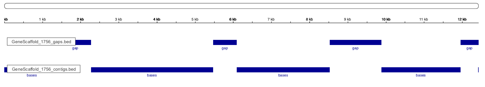

sequencetools
=============

Set of scripts etc. to work with DNA sequence and related files:

#### assemblathon_stats.pl
Basic statistics on contigs and scaffolds. Modifed after https://github.com/ucdavis-bioinformatics/assemblathon2-analysis

#### scaffoldgap2bed.py
Generates a bed-file for the gaps or contigs for a given fasta file
Splits the sequences on gaps of (default): 20 bases. Requires BioPython.

Example in IGV of a short sequence with a track for gaps and contigs from bedfiles generated by the script:



#### trf2gff.py
Converts the output from the TRF program (http://tandem.bu.edu/trf/trf.html)
to a gff file
Requires the `-ngs` flag set (available from TRF version 4.07b).
Really rough code, use at your own risk
Usage:

```
python trf2gff.py trf_outfile.dat >trf_outfile.gff
```

#### fasta_length

Returns the length of each fasta entry, one length per line of output
Usage:

```
fasta_length sequences.fasta
```
